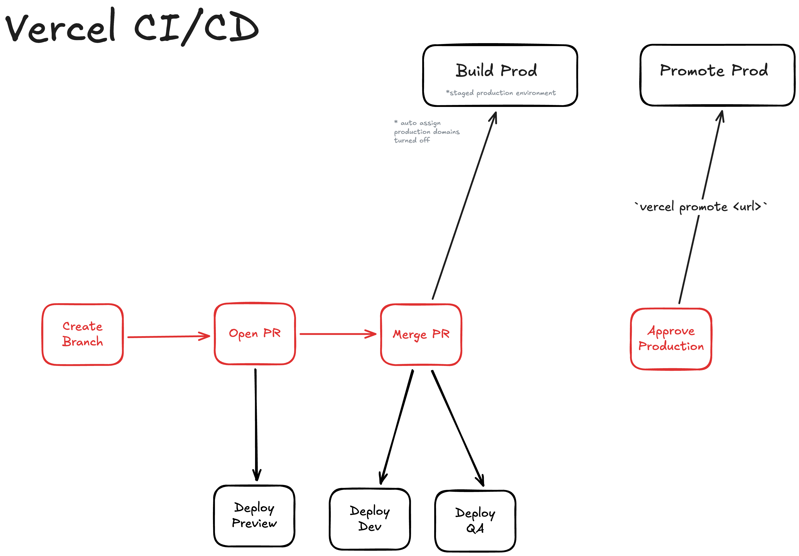

# Approval Deploy Turborepo

Turborepo with two applications manual approval for Vercel production deployments.

## Deployment Flow

1. **PR** → automatic preview deployment (Vercel)
2. **Merge to main** → automatic dev/qa deployment
3. **Manual approval** → promote to production (no rebuild, just updates `current` deployment)

## Setup

### GitHub Secrets

Add to repository settings → Secrets and variables → Actions:

- `VERCEL_TOKEN`: [Create token](https://vercel.com/account/tokens)
- `VERCEL_TEAM`: Team slug from Vercel URL (e.g., `my-team` from `vercel.com/my-team`)

## How to Deploy to Production

1. Merge PR to main - dev/qa deploys automatically to staging
2. Test staged deployment
3. Go to Actions tab → "promote" workflow → "Run workflow"
4. Enter deployment URL (e.g., `https://your-app-abc123.vercel.app`)
5. Click "Run workflow"
6. Deployment promoted to production (no rebuild)

## References

- [Vercel: Staging and Promoting Deployments](https://vercel.com/docs/deployments/promoting-a-deployment#staging-and-promoting-a-production-deployment)
